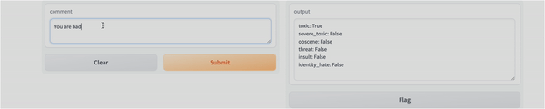

# Comment Toxicity Analysis

## Project Description

This project focuses on analyzing and detecting toxic comments using machine learning techniques, specifically a Long Short-Term Memory (LSTM) neural network. It aims to automatically identify and classify potentially harmful or offensive content in online discussions, helping to maintain healthier online communities.




## Features

- Toxicity detection in comments using LSTM model
- Data preprocessing and tokenization
- Training, validation, and test dataset splitting
- Interactive testing interface using Gradio

## Project Structure

```
COMMENT TOXICITY/
│
├── comment_toxicity_analysis/
│   └── __init__.py
│
├── data/
│   ├── sample_submission.csv
│   ├── test_labels.csv
│   ├── test.csv
│   └── train.csv
│
├── models/
│   ├── .gitkeep
│   └── toxicity.h5
│
├── notebooks/
│   ├── .gitkeep
│   └── comment_toxicity.ipynb
│
├── reports/
│   └── videos/
│
├── .env
├── .gitignore
├── pyproject.toml
├── README.md
├── requirements.txt
└── setup.cfg
```

## Installation

1. Clone this repository:
   ```
   git clone https://github.com/chdl17/comment-toxicity.git
   cd comment-toxicity
   ```

2. Create a virtual environment and activate it:
   ```
   python -m venv venv
   source venv/bin/activate  # On Windows, use `venv\Scripts\activate`
   ```

3. Install the required packages:
   ```
   pip install -r requirements.txt
   ```

## Usage

1. Data Preparation:
   - The project uses the train.csv file located in the `data/` directory.
   - The script preprocesses the data, tokenizes the text, and prepares it for the model.

2. Model Training:
   - The model is a sequential LSTM neural network built using TensorFlow and Keras.
   - To train the model, run the provided Python script or Jupyter notebook.

3. Testing:
   - The project uses Gradio for interactive testing of the model.
   - Run the Gradio interface to input comments and see the toxicity analysis results.

## Model Architecture

The core of this project is an LSTM (Long Short-Term Memory) model with the following architecture:

1. Embedding Layer
2. Bidirectional LSTM Layer
3. Dense Layers for feature extraction
4. Final Dense Layer with sigmoid activation for multi-label classification

The model is compiled using the Adam optimizer and binary crossentropy loss function.

## Sample Code

Here's a snippet of the model architecture:

```python
model = Sequential()
model.add(Embedding(max_words+1, 32))
model.add(Bidirectional(LSTM(32, activation='tanh')))
model.add(Dense(128, activation='relu'))
model.add(Dense(256, activation='relu'))
model.add(Dense(128, activation='relu'))
model.add(Dense(6, activation='sigmoid'))

model.compile(optimizer='adam', loss='binary_crossentropy', metrics=['accuracy'])
```

## Future Improvements

- Increase training data and epochs for better model performance
- Implement more advanced NLP techniques like attention mechanisms
- Develop a web application for easier access to the toxicity analysis tool
- Explore other model architectures for comparison

## Technologies Used

- Python
- TensorFlow and Keras for deep learning
- Pandas for data manipulation
- Gradio for interactive testing
- Jupyter Notebook for development and analysis


## Contact

Project Link: [https://github.com/chdl17/comment-toxicity](https://github.com/chdl17/comment-toxicity)
